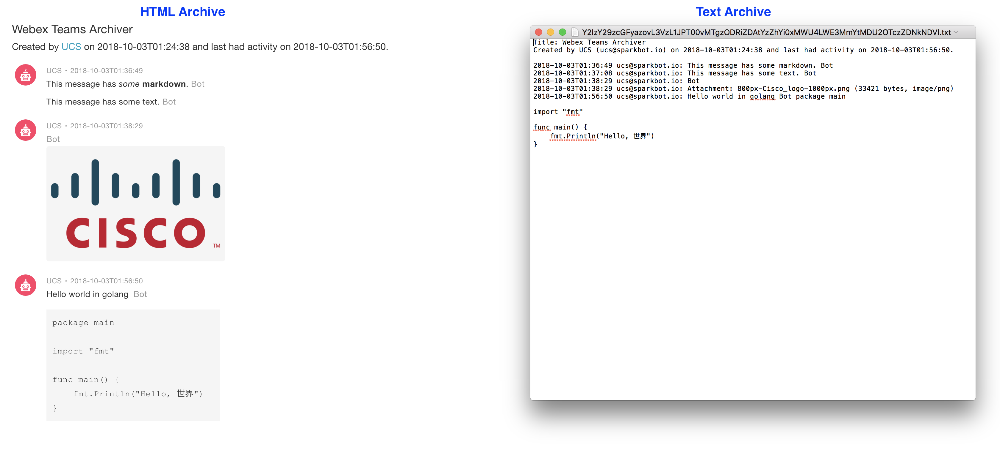

=====================
Webex Teams Archiver
=====================

*Simple utility to archive Webex Teams rooms*

.. image:: https://img.shields.io/badge/license-MIT-blue.svg
    :target: https://github.com/CiscoDevNet/webex-teams-archiver/blob/master/LICENSE
.. image:: https://img.shields.io/pypi/v/webexteamsarchiver.svg
    :target: https://pypi.python.org/pypi/webexteamsarchiver

-------------------------------------------------------------------------------

Webex Teams Archiver extracts the messages and files out of a Webex Teams room and saves them in text and HTML formats.

Example
-------

.. code-block:: python

    from webexteamsarchiver import WebexTeamsArchiver

    personal_token = "mytoken"
    archiver = WebexTeamsArchiver(personal_token)
    
    # room id from https://developer.webex.com/endpoint-rooms-get.html 
    room_id = "Y2lzY29zcGFyazovL3VzL1JPT00vd2ViZXh0ZWFtc2FyY2hpdmVy"
    archiver.archive_room(room_id)
    
Produces the following files:

.. code-block:: bash

    $ ls 
    Y2lzY29zcGFyazovL3VzL1JPT00vd2ViZXh0ZWFtc2FyY2hpdmVy.tgz
    Y2lzY29zcGFyazovL3VzL1JPT00vd2ViZXh0ZWFtc2FyY2hpdmVy

    $ ls Y2lzY29zcGFyazovL3VzL1JPT00vd2ViZXh0ZWFtc2FyY2hpdmVy/
    Y2lzY29zcGFyazovL3VzL1JPT00vd2ViZXh0ZWFtc2FyY2hpdmVy.html
    Y2lzY29zcGFyazovL3VzL1JPT00vd2ViZXh0ZWFtc2FyY2hpdmVy.txt
    files/

Below is an example of a simple room that got archived.

Note: The HTML version of the archive requires Internet connectivity because of CSS and avatars.

Installation
------------

Installing and upgrading is easy:

**Install via PIP**

.. code-block:: bash

    $ pip install webexteamsarchiver

**Upgrading to the latest Version**

.. code-block:: bash

    $ pip install webexteamsarchiver --upgrade

Options
-------

The `archive_room` method exposes the following options:

+----------------------+-------------------+---------------------------------------------------+ 
| Argument             | Default Value     | Description                                       | 
+======================+===================+===================================================+
| overwrite_folder     | True              | Overwrite the archive folder if it already exists |
+----------------------+-------------------+---------------------------------------------------+
| delete_folder        | False             | Delete the archive folder when done               |
+----------------------+-------------------+---------------------------------------------------+
| reverse_order        | True              | Order messages by most recent on the bottom       |
+----------------------+-------------------+---------------------------------------------------+
| download_attachments | True              | Download attachments sent to the room             |
+----------------------+-------------------+---------------------------------------------------+
| download_workers     | 15                | Number of download workers for downloading files  |
+----------------------+-------------------+---------------------------------------------------+
| text_format          | True              | Create a text version of the archive              |
+----------------------+-------------------+---------------------------------------------------+
| html_format          | True              | Create an HTML version of the archive             |
+----------------------+-------------------+---------------------------------------------------+
| timestamp_format     | %Y-%m-%dT%H:%M:%S | Timestamp strftime format                         |
+----------------------+-------------------+---------------------------------------------------+

Questions, Support & Discussion
-------------------------------

webexteamsarchiver_ is a *community developed* and *community supported* project. Feedback, thoughts, questions, issues can be submitted using the issues_ page.

Contribution
------------

webexteamsarchiver_ is a *community developed* project. Code contributions are welcome via PRs!

*Copyright (c) 2018 Cisco and/or its affiliates.*

.. _webexteamsarchiver: https://github.com/CiscoDevNet/webex-teams-archiver
.. _issues: https://github.com/CiscoDevNet/webex-teams-archiver/issues
